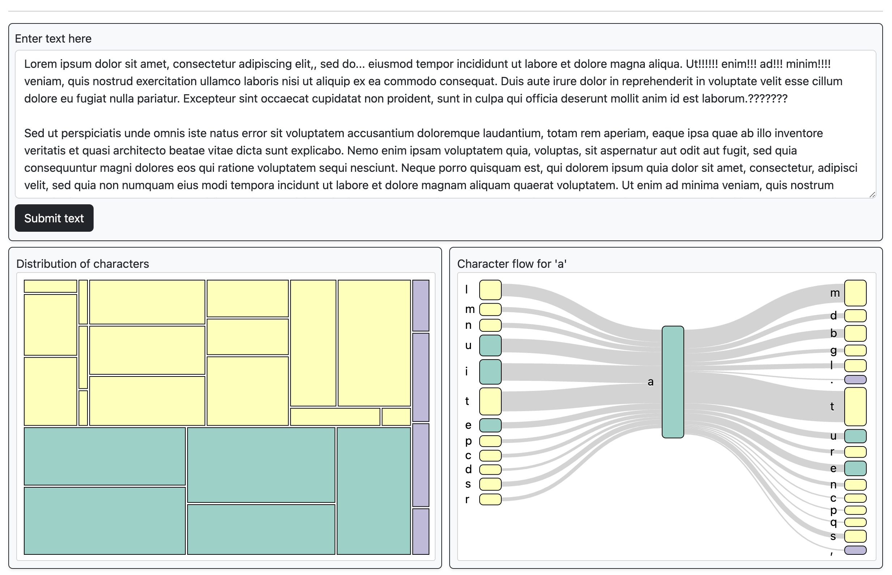

# TextViz

**TextViz** is a D3.js-based interactive tool designed to visualize text data. It creates a **Treemap** and **Sankey Diagram** to illustrate character distribution and flow based on user input, offering an insightful, visual way to explore character sequences in text.

## Table of Contents
1. [Project Overview](#project-overview)
2. [Features](#features)
3. [Usage Instructions](#usage-instructions)
4. [Data Description](#data-description)

## Project Overview

This project enables interactive text visualization through a Treemap and Sankey diagram, each offering unique insights:
- **Treemap**: Groups characters by type (vowels, consonants, punctuation) and sizes rectangles based on frequency.
- **Sankey Diagram**: Displays character flow, showing which characters precede or follow the selected character in the text.



## Features

- **Treemap Visualization**: Displays character distribution in a grouped, color-coded hierarchy.
- **Sankey Diagram**: Visualizes the flow of selected characters with customizable Sankey links.
- **Interactive Tooltips**: Provides data insights through hover events on each chart.
- **Linked Highlighting**: Highlights character occurrences in both charts and the input text field.

## Usage Instructions

1. **Input Text**: Enter text in the `textarea` and click **Submit text** to generate the treemap visualization.
2. **Interact with Treemap**: Hover over rectangles to view tooltip information, and click a rectangle to create a corresponding Sankey diagram.
3. **Explore Sankey Diagram**: Examine the character flow based on your selection.

## Data Description

- **Consonants**: `bcdfghjklmnpqrstvwxz`
- **Vowels**: `aeiouy` (consider `y` as a vowel for this project)
- **Punctuation**: `.,!?:;` (additional punctuation can be supported if desired)

Characters other than the above, including whitespace and special symbols (e.g., `$`, `@`), are ignored.

Example input:
```html
Lorem Ipsum Dolor Sit Amet! Consectetur Adipiscing elit?
